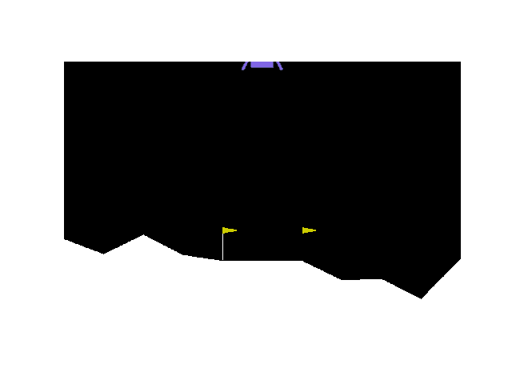

# Reinforcement-Learning
This repository implements different reinforcement learning techniques. First a novel environment is created that simulates the NYC grid. This environment will simulate a waze app where the agent learns to avoid traffic. Traffic is implemented as a dynamic feature, simulating a real world scenario. 

