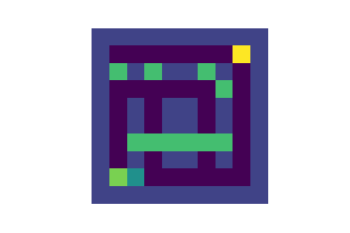

## Reinforcement-Learning

# NYC Maze
This repository implements different reinforcement learning techniques. First a novel environment is created that simulates the NYC grid. This environment will simulate a waze app where the agent learns to avoid traffic. Traffic is implemented as a dynamic feature, simulating a real world scenario. 

# Lunar Lander
Here all kinds of DQN methods are implemented for the lunar lander of openAI gym. These methods are combined to produce rainbows with the best performing architectures and are compared to A3C. 

architectures implemented (Lunar_Lander/Different_DQN_Networks):
- DQN
- Double DQN
- Dueling DQN
- Noisy DQN
- Prioritized Experience Replay DQN
- Multi-step DQN

The graph shows that the multi-step DQN performs best so the rainbow methods are compared to multi-step. 

Next the performance of the rainbows is compared to A3C.

We can now show the difference in performance between the untrained agent and the trained agent. 

